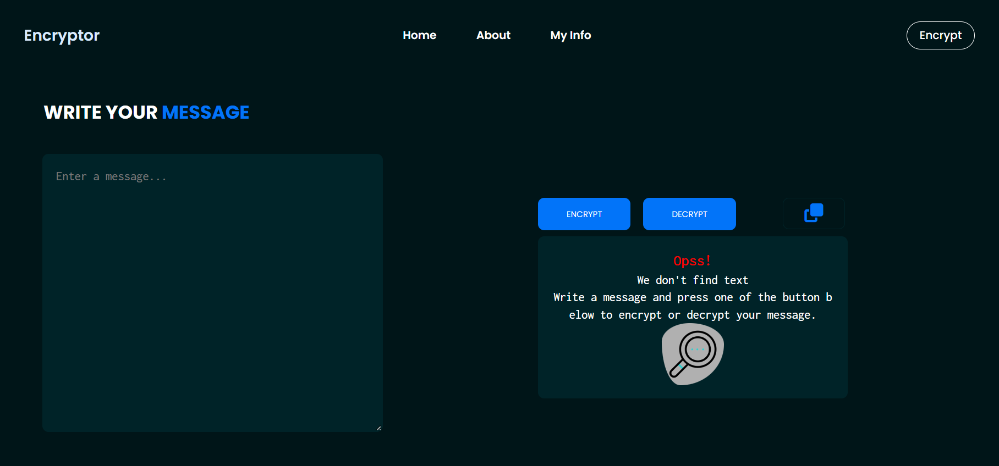
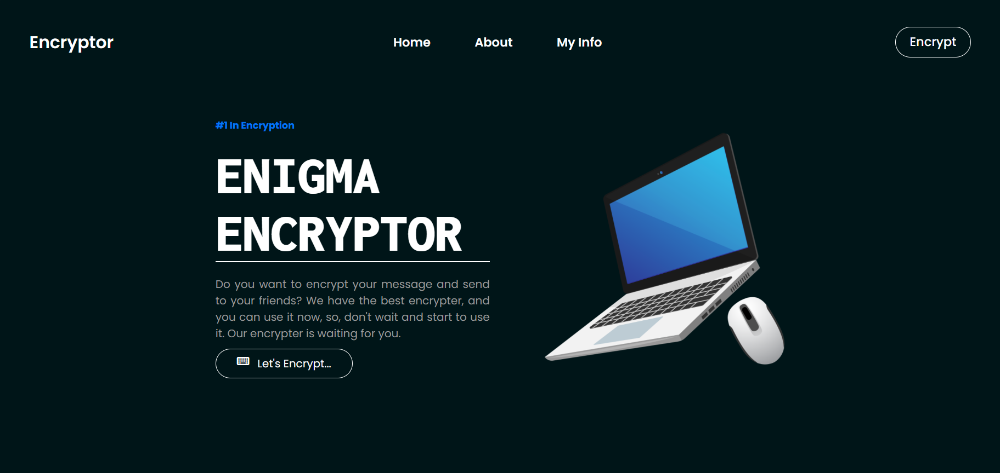

# 🚀 Encrypter - Educational Challenge Journey With ONE 🌟

## Greetings, Fellow Challengers! 👋🎓

I'm thrilled to share my exhilarating experience in the Alura-Oracle Educational Challenge, a fantastic collaboration between Alura, Oracle, and its ONE program (Oracle Next Education). Join me on this riveting educational adventure where learning meets innovation! 🌈

<a href="https://crisandev.github.io/encrypter/index.html" target="_blank" title="View Project">View Project</a>
 
<a href="https://crisandev.github.io/encrypter/index.html" target="_blank">https://crisandev.github.io/encrypter/index.html</a>

## How the Encryption Challenge Works 🔐🤖

But the excitement didn't stop there! A captivating twist awaited us – the Encryption Challenge. I dived into the world of cryptic transformations, turning vowels into a mesmerizing dance of words:

- "e" ➡️ "enter"
- "i" ➡️ "imes"
- "a" ➡️ "ai"
- "o" ➡️ "ober"
- "u" ➡️ "ufat"

## How I Encrypted with Flair 🤓🔍

"Hello, world!" became "Henterllober, woberrld!" – a cryptic masterpiece that added a touch of whimsy to my journey. 🌐

## Reflecting on the Adventure 🌟🤝

As I wrap up this chapter of the challenge, I'm filled with gratitude for the opportunity to contribute to transformative solutions in the world of education. This collaborative odyssey has not only deepened my knowledge but also connected me with a vibrant community of like-minded learners. 🚀

Here's to the Alura-Oracle Educational Challenge – a journey of discovery, innovation, and community! 🌠✨

---------------
<h3 align="center">Home View</h3>

  

<h3 align="center">Encryption Challenge View</h3>

  

Happy Coding! 🌠✨
